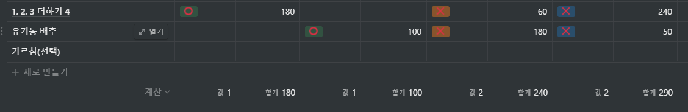

# 두번째

모임 날짜: 2022년 2월 10일
참석: 이우현, 한빈 배, Yeonggyeong Gong, 마주리

- 소감:
  
    - 공영경:
        - 처음부터 백준 골드랑 실버 상위 티어는 조금 힘들었다. 1, 2, 3 더하기 4를 푸는데 3시간 정도 소요되었다. 그래도 풀게 되어서 다행이지만 아직 남에게 설명하기에는 조금 어려움이 있어서 좀 더 정리를 해야겠다. 유기농 배추 문제는 다른 분들의 설명을 듣고 조금 더 디버깅이 필요할 것 같다. 그래도 뿌듯한 시간이었당~!~!~!
    - 마주리:
        - 총 세 문제를 풀기로 했는데, 유기농 배추 한 문제를 풀었다. 깃을 올리는 과정에서 뭔가 잘못되어서 폴더가 다 날라가버리기도 했다. 😢 우당탕탕 좌충우돌이었다. 앞으로는 조금 더 나아지겠지..?
        - 1, 2, 3 더하기 4 문제는 혼자 푸는 과정에서도 뭔가 알 듯 말 듯했는데, 영경님의 풀이를 들어도 알 듯 말 듯,,, 큐ㅠㅠ 푸는 방식이 이해는 갔는데, 왜 그런건지가 이해가 안 가는 매직..
        - 다음 모임까지는 알고리즘 유형에 필터링을 걸어서 좀 더 풀 수 있는 범위라고 생각되는 문제들을 선택했다. 주말동안 화이팅~~!!
        
    - 배한빈:
        - 문제는 총 2 + 1으로 기본 `화수 한문제씩` 풀고 `보너스문제` 하나 있었다.
        - 보너스 문제는 꿈도 못꾸고 기본 2문제 중 어느 한 문제 중 하나라도 풀지 못했다.
        - 스터디 내에 피드백 받아 풀어봤지만 성공은 아직이고 노력이 많이 필요하다는 것만 느낌
        - 유기농 배추 문제 : `remove`같은 함수의 사용이 안된다는걸 깜빡하고 풀었다. 왠지 스무스했다. 아직까지 뭐가 문제인지 모르겠음
        - 1,2,3 더하기 4 문제 : 영경님이 덕분에 어떤식으로 접근해야 하는지 감만 살짝 잡은 상태. 그치만 해결하려면 아직 먼 것 같다.
        - 변명 : 스터디 마지막에 주리님의 얘기처럼 아직 배우지 않은 알고리즘이 적용된 문제를 푼 것도 이유가 아니었을까 싶다. 덕분에 다음 문제의 선정은 좀더 신중했다.
        - 한마디 : 게임도 실버는 졸업했는데 내 알고리즘 실력은 브론즈가 아닐까.
    - 이우현:
      
        본인 총평: 문제를 좀 잘 풀어보자
        
        - 첫번째에 이어 아직 자기객관화가 안되어 있는 문제선정...ㅋㅋㅋ
        - 한 문제에 240분을 박았다.
        - 근데 틀렸다.
        - 한 문제에 2시간 이상 소요하면 다른 문제에 손을 뻗어보자.
        - 덕분에 가르침문제는 구경도 못했다.
        - 123더하기 4 문제, 영경님 풀이 이해가 될듯 말듯 하다. 나중에 관련 알고리즘을 배워서 다시 도전해봐야 겠다.
        - 유기농 배추 문제는 주리님과 비슷하게 풀었다. 한빈님도 약간 다르긴 한데 큰 방향성은 비슷하다고 생각한다.
    
- 정리